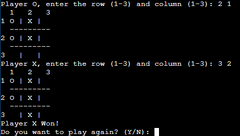

# Tic-Tac-Toe in C++


## Description

This is a simple Tic-Tac-Toe game implemented in C++. Allows two players to play on one terminal. The game uses a 3x3 board and follows the classic rules of tic-tac-toe.

## Screenshots



## How to play

1. Clone the repository to your local machine.
2. Compile the C++ code using an appropriate compiler such as g++.
3. Run the game:

    ```bash
    ./main

4. Follow the instructions on the terminal to play the game.

## Characteristics

- Implementation in C++.
- Simple command line interface (CLI).
- Support for two players.

## License

This project is licensed under the MIT License - see the [LICENSE](LICENSE) file for more details.